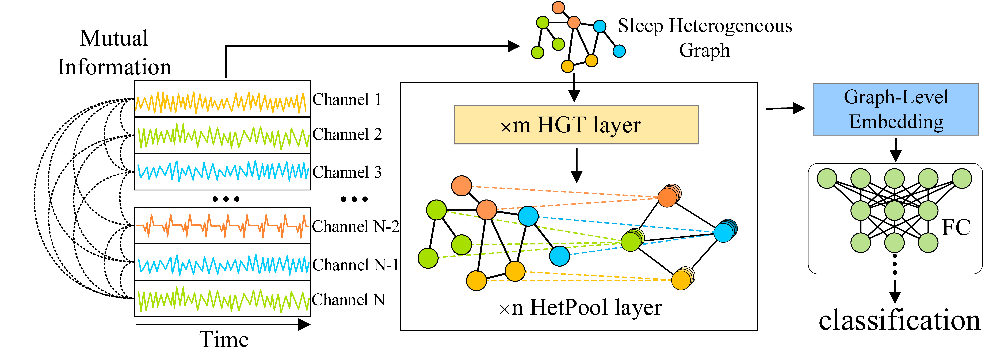

# Heterogeneous Graph Pooling Neural Network for Sleep Stage Classification




## Requirements

- Python 3.7.4
- PyTorch 1.4.0
- PyTorch Geometric 1.4.3
- CUDA 10.1
- numpy 1.18.5
- matplotlib 3.2.2
- scikit-learn 0.23.1


## Training and Evaluation

Run this command for training and evaluation:

```train
python training.py -c ../configs/isruc-1.ini
```


## Results

Our model achieves the following performance on ISRUC-1 and ISRUC-3:

| Dataset | F1-score | Accuracy |
| :-----: | :------: | :------: |
| ISRUC-1 |  76.64%  |  79.80%  |
| ISRUC-3 |  78.65%  |  80.56%  |


## Contributing

The code of this repository is released under the [MIT](https://github.com/Anonymous-IJCAI-22/HGPNN/blob/main/LICENSE) license.

